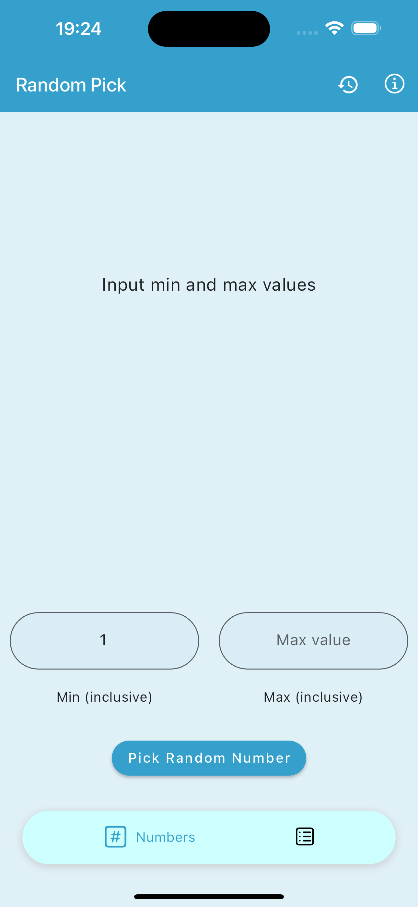
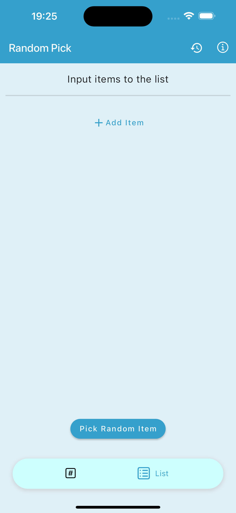
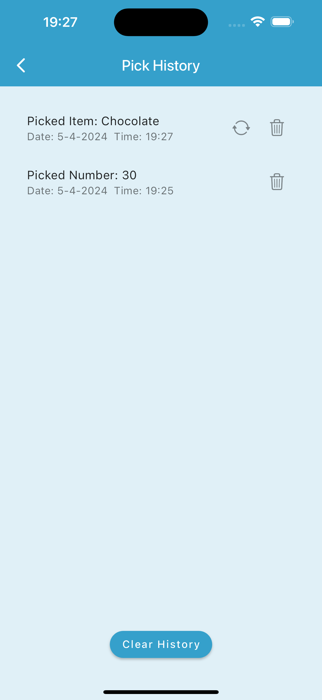

    

<h1 align="center">Random Pick</h1>

    an application which decides/picks an item from the given pool

 <!-- <a href="https://randompick.immadisairaj.dev">
    </img>
  </a> -->
  
  
  
  

  
  

 

## What this app does

The application has the following functions as of now.

1. Numbers - It takes in two integer values __min__ _(inclusive)_ and __max__ _(inclusive)_, then returns a picked random number from the range.
2. List - It takes a list of items[1], then returns a random item (picked) from the pool. The items inside the list can be (un)checked to include in the item pool.
3. History - All the picks are stored in the device, with an option to delete them when not needed.

[1]item: The item can be any string - a number, a name, a place, an animal, a thing, an object, etc.

## Motivation

As a Sri Sathya Sai Baba devotee, whenever struck somewhere, we have a habit of writing a few chits, putting them near Swamy and then picking one of the chits. We then blindly follow what is there in the chit as a command from Swamy.

Many people across the globe use the similar concept of picking randomly to decide something, which inspired me to create this application, in general, to solve the problem using an application that is handy and paper-free.

## Screenshots

      

## Architecture

This application uses a clean architecture (feature first) with the help of bloc library for the business logic.

## Open Source Libraries

Thanks to the Open Source community for providing many great libraries which improve the application performance in many great ways.

## Privacy Policy

The Privacy Policy of the app is in the site: [https://randompick.immadisairaj.dev/privacy_policy.html](https://randompick.immadisairaj.dev/privacy_policy.html)

## License

The project is licensed under the BSD-3-Clause License, see the [LICENSE.md](https://github.com/immadisairaj/random_pick/blob/main/LICENSE.md) for more details
